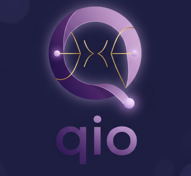
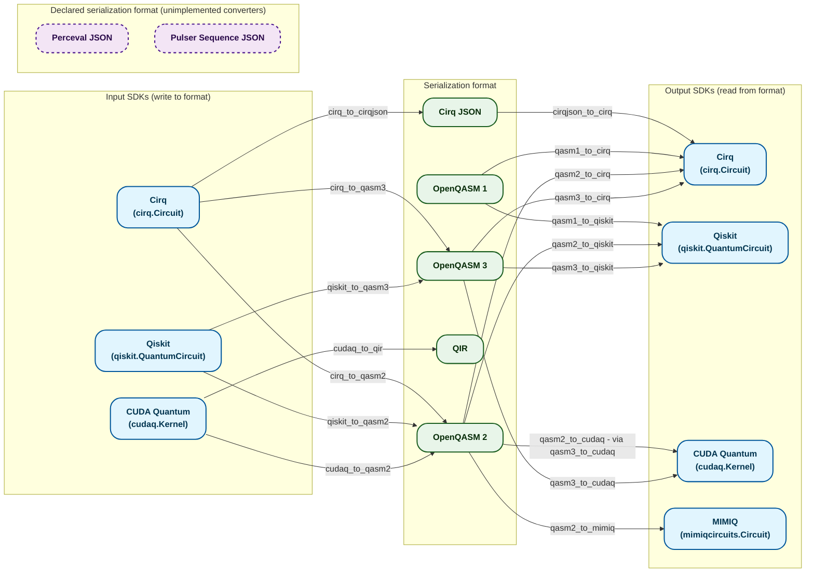
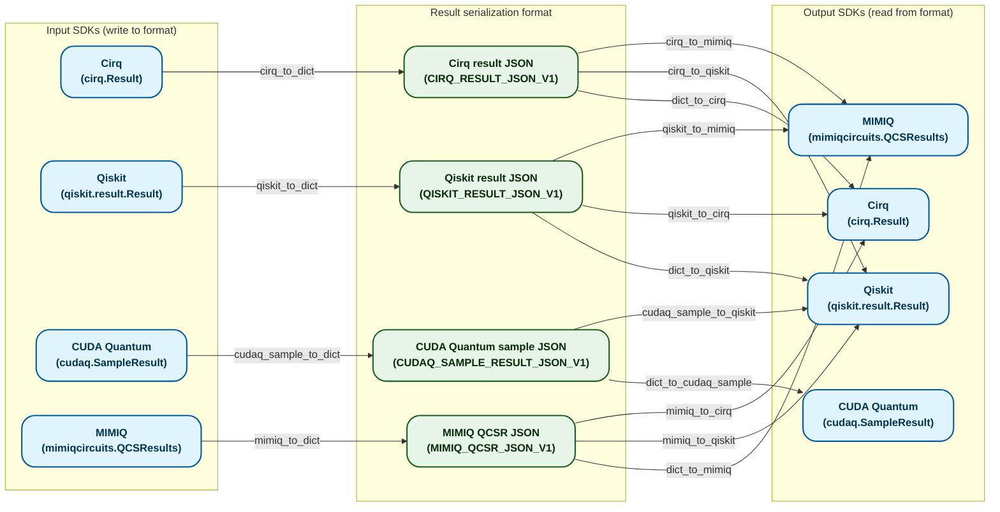

<p align="center"></p>

# qio
`qio` is a python package to smoothly manipulate quantum computing objects between client and server.

It handle all the conversion boilerplate to focus your dev on your quantum SDK and backend on real matters.

## Installation

We encourage installing `qio` via the pip tool (a Python package manager):

```bash
pip install qio
```

## Getting started

To leverage `qio` and get quick interoperability between your frontend and your backend, you simply need to use qio wrappers system.

Here a snippet code for `cirq` and `qsim`:

```python
import cirq

from cirq.circuits import Circuit
from qsimcirq import QSimSimulator

from qio.core import (
    QuantumComputationModel,
    QuantumComputationParameters,
    QuantumProgramResult,
    QuantumProgram,
)

#############
# Client side

qc = _random_cirq_circuit(10)
shots = 100

program = QuantumProgram.from_cirq_circuit(qc)

model_json = QuantumComputationModel(
    programs=[program],
).to_json_str()

parameters_json = QuantumComputationParameters(
    shots=shots,
).to_json_str()

# Send this to server side

###########################
# Server / Computation side

model = QuantumComputationModel.from_json_str(model_json)
params = QuantumComputationParameters.from_json_str(parameters_json)

circuit = model.programs[0].to_cirq_circuit()

qsim_simulator = QSimSimulator()

qsim_result = qsim_simulator.run(circuit, repetitions=params.shots)

program_result = QuantumProgramResult.from_cirq_result(result).to_json_str()

# Send this to back to client side

#####################
# Back to client side

cirq_result = qresult.to_cirq_result()

qiskit_result = qresult.to_qiskit_result()
```

## qio circuit conversion mapping

Map of the SDKs integrated in `qio` and the conversion links between them
(**circuits** branch / `QuantumProgram` — *results* conversions are not
represented here).

- **Conversion flow**: an SDK node is translated into a serialization format
  (OpenQASM, QIR, Cirq JSON), then reloaded by another SDK.
- The converters are located in `qio/utils/conversion/program/`.
- `Perceval JSON` and `Pulser Sequence JSON` are declared in the
  `QuantumProgramSerializationFormat` enum but **no converter is implemented**.



### Entrypoints in `qio`

| Source SDK | Write method | Supported output formats |
|---|---|---|
| Cirq | `QuantumProgram.from_cirq_circuit` | Cirq JSON, OpenQASM 2, OpenQASM 3 |
| Qiskit | `QuantumProgram.from_qiskit_circuit` | OpenQASM 2, OpenQASM 3 |
| CUDA Quantum | `QuantumProgram.from_cudaq_kernel` | OpenQASM 2 (+ QIR via `cudaq_to_qir`) |

| Target SDK | Read method | Supported input formats |
|---|---|---|
| Cirq | `QuantumProgram.to_cirq_circuit` | OpenQASM 1/2/3, Cirq JSON |
| Qiskit | `QuantumProgram.to_qiskit_circuit` | OpenQASM 1/2/3 |
| CUDA Quantum | `QuantumProgram.to_cudaq_kernel` | OpenQASM 2/3 |
| MIMIQ | `QuantumProgram.to_mimiq_circuit` | OpenQASM 2 |

## qio result conversion mapping

Map of the SDKs integrated in `qio` and the conversion links between them
(**results** branch / `QuantumProgramResult`).

- **Conversion flow**: an SDK result is serialized into a dedicated JSON format
  (`*_RESULT_JSON_V1`), then reloaded by an SDK (its own or another one).
- Unlike circuits, there is **no shared format** (no QASM): each SDK has its own
  JSON format, and cross conversions directly link one JSON format to another
  SDK.
- The converters are located in `qio/utils/conversion/program_result/`.



### Entrypoints in `qio`

| Source SDK | Write method | Output format |
|---|---|---|
| Cirq | `QuantumProgramResult.from_cirq_result` | `CIRQ_RESULT_JSON_V1` |
| Qiskit | `QuantumProgramResult.from_qiskit_result` | `QISKIT_RESULT_JSON_V1` |
| CUDA Quantum | `QuantumProgramResult.from_cudaq_sample_result` | `CUDAQ_SAMPLE_RESULT_JSON_V1` |
| MIMIQ | `QuantumProgramResult.from_mimiq_qcsr` | `MIMIQ_QCSR_JSON_V1` |

| Target SDK | Read method | Supported input formats |
|---|---|---|
| Cirq | `QuantumProgramResult.to_cirq_result` | `CIRQ_RESULT_JSON_V1`, `QISKIT_RESULT_JSON_V1`, `MIMIQ_QCSR_JSON_V1` |
| Qiskit | `QuantumProgramResult.to_qiskit_result` | `QISKIT_RESULT_JSON_V1`, `CIRQ_RESULT_JSON_V1`, `CUDAQ_SAMPLE_RESULT_JSON_V1`, `MIMIQ_QCSR_JSON_V1` |
| CUDA Quantum | `QuantumProgramResult.to_cudaq_sample_result` | `CUDAQ_SAMPLE_RESULT_JSON_V1` |
| MIMIQ | `QuantumProgramResult.to_mimiq_qcsr` | `MIMIQ_QCSR_JSON_V1`, `CIRQ_RESULT_JSON_V1`, `QISKIT_RESULT_JSON_V1` |
